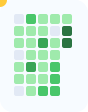

  
  <h1>Yamac Gursel</h1>
  
<strong>Full-stack engineer</strong> building AI/ML-first products on resilient cloud foundations.

  
Shipping fast, measuring impact, and keeping it humane.

---

### Quick Links

[Portfolio](https://example.com) | [Email](mailto:yamacgursel0@gmail.com) | [Patreon](https://patreon.com/YamacGursel) | [Resume](https://example.com/resume.pdf) | [Projects](https://github.com/Kinin-Code-Offical?tab=repositories)

---

### Now (this month)

- Shipping a lightweight AI-assisted dashboard for ops teams.
- Experimenting with edge + serverless hybrids on AWS/GCP.
- Mentoring students on modern TypeScript and MLOps fundamentals.

### Story in one breath

- I design and deliver end-to-end features: product shaping -> architecture -> shipping -> observability.
- I love pairing ML systems with friendly frontends and deployable infra (Docker, k8s, serverless).
- Looking to collaborate on AI copilots, data apps, and cloud-native developer tooling.

---

### Featured Projects (auto-curated)

<!-- FEATURED-PROJECTS:START -->
- [Kinin-Code-Offical/kinin-next-template](https://github.com/Kinin-Code-Offical/kinin-next-template): Production-grade Next.js starter with TypeScript, testing, and CI baked in. | Stars: 12 | curated
- [Kinin-Code-Offical/ml-toolkit](https://github.com/Kinin-Code-Offical/ml-toolkit): Reusable ML utilities for fast prototyping and MLOps demos. | Stars: 8 | curated
- [Kinin-Code-Offical/cloud-starters](https://github.com/Kinin-Code-Offical/cloud-starters): IaC blueprints for AWS and GCP with sensible defaults. | Stars: 6 | curated
<!-- FEATURED-PROJECTS:END -->

Updated daily via GitHub Actions. Edit <a href="scripts/config.json">scripts/config.json</a> to override.

---

### Skills / Stack

**Frontend**  React, Next.js, TypeScript, Angular; design systems that ship and stay maintainable.

**Backend**  Node.js, Java, C/C++, C#, REST/GraphQL APIs; performance-minded services.

**Cloud / DevOps**  AWS, GCP, Docker, CI/CD, IaC; resilient deployments with logging + tracing.

**AI / ML**  Python, PyTorch, TensorFlow, Jupyter; data pipelines, model serving, lightweight RAG.

**Tooling**  Git, npm, pnpm, Firebase, Flutter, Arduino, Electron, Photoshop/After Effects for polish.

  
Icon strip (kept from original)

  

    
    
    
    
    
    
    
    
    
    
    
    
    
    
    
    
    
    
    
    
    
    
    
    
    
    
    
    
    
    
    
    
    
    
    
    
    
    
    
    
    
    
    
    
    
    
    
    
    
    
    
  

---

### Metrics & Live Signals

- Auto-refreshed daily with GitHub Actions (no extra secrets; uses the default token).
- Designed to degrade gracefully: if generators fail, placeholders stay visible.

  
  

<picture>
  <source media="(prefers-color-scheme: dark)" srcset="./assets/cards/pacman-dark.svg">
  <source media="(prefers-color-scheme: light)" srcset="./assets/cards/pacman-light.svg">
  
</picture>

  
Extra GitHub stats (optional)

  

    
    
    
  

---

### Credibility (highlights)

- Certifications: AWS/GCP fundamentals (expandable to associate/pro levels), ML course completions.
- Notable contributions: code reviews and fixes across internal tooling; mentoring students on full-stack + ML.
- Hackathons: rapid prototyping of AI copilots and data dashboards; iterative demos with real users.
- Open source intent: looking to maintain reusable templates (Next.js, IaC) and ML starter kits.

### Contact / Collaboration

- Email: [yamacgursel0@gmail.com](mailto:yamacgursel0@gmail.com)
- Patreon: [Support the work](https://patreon.com/YamacGursel)
- LinkedIn / Twitter / Discord: placeholders in scripts/config.json  plug in and go.
- Collaboration: AI features, developer tooling, cloud-native apps, or fast product spikes.

---

  
Lite mode (commented block)

  Remove or comment out heavy images above if you prefer text-only:
  <!--
  - Featured list stays.
  - Remove the metric card images block.
  - Keep contact + skills for fastest render.
  -->

  

